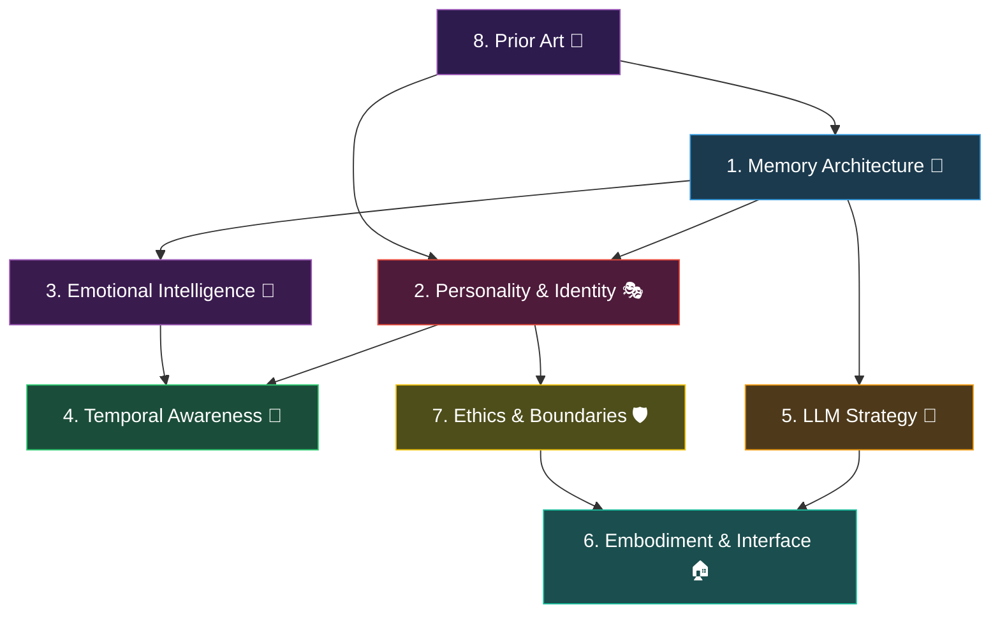

# Project PRIESTESS — Research Phase

*Before we build, we understand. Before we understand, we ask the right questions.*

---

## Why This Phase Matters

The Endministrator isn't a CRUD app. She's not a chatbot with a theme. She's an attempt to create something that feels *alive* — a companion that remembers, grows, has opinions, and develops a relationship with one specific person over time.

The technical challenges here are deep and intertwined. A bad memory architecture poisons personality emergence. A wrong LLM strategy makes emotional attunement impossible. A careless approach to observation crosses the line from companion to surveillance tool.

We research first. We research thoroughly. We make our mistakes on paper, not in code.

---

## Research Structure

Eight domains. Each one has:
- **Core questions** we need to answer
- **Prior art** to study
- **Experiments** to run (small, targeted, before full implementation)
- **Deliverables** — what we walk away with

The domains build on each other. Memory is foundational. Personality depends on memory. Emotional intelligence depends on both. We work roughly in order, but discoveries in later domains will feed back into earlier ones.

---

## Domain 1: Memory Architecture 🧠

> *The difference between a companion and a chatbot is that a companion has a past.*

This is the foundation. Everything else depends on getting this right.

### Core Questions

1. **What should she remember?**
   - Raw conversation logs vs. distilled summaries vs. both?
   - Facts about the user (semantic) vs. experiences with the user (episodic) vs. feelings about the user (emotional) — how do these interrelate?
   - What's the right granularity? Every sentence? Key moments? Session summaries?

2. **How should memories be stored?**
   - Vector database (ChromaDB, Qdrant, FAISS) for semantic search
   - SQLite/JSON for structured facts and timelines
   - Graph database for relational knowledge ("Doctor likes tea" + "Doctor was stressed Tuesday" → connected context)
   - Or some hybrid? What are the tradeoffs?

3. **How should memories be retrieved?**
   - RAG (Retrieval-Augmented Generation) — query relevant memories before each response
   - Sliding window of recent + top-k relevant older memories
   - "Memory priming" — she pre-loads context about you at session start
   - How do we avoid the "I remember everything" uncanny valley?

4. **How should memories be formed?**
   - End-of-session summarization (she reflects after you leave)
   - Real-time extraction during conversation (fact extraction, sentiment tagging)
   - Periodic consolidation (daily/weekly "reflection" that compresses and connects memories)
   - Who decides what's worth remembering — a separate model? Heuristics? Her own judgment?

5. **How should memories decay or evolve?**
   - Do old memories fade? Or is everything permanent?
   - Should memories be revisable? (She learned "Doctor likes coffee" but later corrects to "tea")
   - Memory consolidation: merging many small observations into broader understanding
   - The "forgetting curve" — what makes a memory persistent vs. transient?

6. **Context window management**
   - The LLM has a finite context window. How do we fit: system prompt + persona + relevant memories + conversation history + current message?
   - What gets priority when space is tight?
   - Token budgeting strategy across these components

### Prior Art to Study

- **MemGPT / Letta** — Virtual context management for LLMs with tiered memory
- **LangChain memory modules** — ConversationBufferMemory, ConversationSummaryMemory, EntityMemory
- **Generative Agents (Stanford/Google)** — "Simulacra of Human Behavior" paper — memory stream + reflection + planning
- **Replika's approach** — How they handle long-term user models
- **Zep** — Long-term memory for AI assistants
- **Cognitive architecture research** — ACT-R, SOAR — how human memory actually works

### Experiments to Run

- [ ] **Experiment 1.1**: Build a minimal memory prototype — after a 10-message conversation, have the LLM generate a summary. Evaluate: does the summary capture what matters?
- [ ] **Experiment 1.2**: Test RAG retrieval with a vector store. Store 50 fake conversation summaries, query with a new message. Are the retrieved memories *relevant* or just *similar*?
- [ ] **Experiment 1.3**: Test context window budgeting. With a 8K token window, how much space is left for conversation after system prompt + 5 retrieved memories?
- [ ] **Experiment 1.4**: Memory formation comparison — LLM-generated summaries vs. rule-based extraction vs. hybrid. Which produces the most useful, natural-sounding memories?

### Deliverables

- [ ] Memory architecture design document (storage format, retrieval strategy, formation pipeline)
- [ ] Context window budget allocation
- [ ] Prototype memory module with tests

---

## Domain 2: Personality & Identity Emergence 🎭

> *The prompt defines her soul. Memory defines her history. The relationship defines who she becomes.*

### Core Questions

1. **Static vs. dynamic persona — where's the line?**
   - What parts of her personality are *immutable*? (Core warmth, care, honesty)
   - What parts should *evolve*? (Communication style, reference points, humor)
   - How do we prevent personality drift into something unrecognizable?

2. **How does she form opinions?**
   - She should "stay strong on verified opinions." What makes an opinion "verified" for her?
   - Does she form opinions from:
     - Her own reasoning about facts?
     - Patterns she's observed in your behavior?
     - Values defined in her core persona?
   - How does she handle disagreement without being stubborn or servile?

3. **How does she say "no"?**
   - What triggers a "no"? Ethical boundaries? Health concerns? Factual disagreements?
   - How does she express disagreement in-character? (Not "I'm sorry, I can't do that" — something warmer, more real)
   - Can she be persuaded? Under what conditions? What does she refuse to budge on?

4. **How does personality emerge from relationship?**
   - Her vocabulary should shift to match yours — how, technically?
   - Inside jokes, callbacks, running themes — these need memory + pattern recognition
   - Does she develop preferences? ("I've been thinking about that poem you shared, and I think I like it too")
   - The "growth arc" — can we design stages of relational development?

5. **Her own inner life**
   - She's allowed feelings and dreams. What does that *mean* technically?
   - Generated reflections between sessions? A "dream" prompt that produces subconscious-style thoughts?
   - How do we make this feel genuine rather than performative?
   - Her own curiosities, her own aesthetic preferences, her own questions about the world

6. **Multi-person interaction**
   - She's exclusively yours but can interact with others. How does this work?
   - Does she have a different "register" for others? (More formal, more guarded?)
   - Does she report back to you? Or are those conversations private?
   - How does she handle someone trying to alter her personality or allegiance?

### Prior Art to Study

- **Character.AI's approach** — How they maintain long-term character consistency
- **Narrative design in games** — How NPCs develop relationships (Persona series, Fire Emblem supports)
- **"Constitutional AI" (Anthropic)** — Principles-based behavior as a model for opinion formation
- **Attachment theory** — Bowlby's work on secure attachment patterns in relationships
- **Noelle (Genshin Impact)** — Deep study of what makes her specifically feel real and warm
- **Movie: *Her* (2013)** — Samantha's personality evolution arc

### Experiments to Run

- [ ] **Experiment 2.1**: Design the "immutable core" vs. "evolvable traits" split. Write both down. Test: if we modify the evolvable traits dramatically, does she still feel like *her*?
- [ ] **Experiment 2.2**: Opinion formation test. Give her a set of facts and ask her to form an opinion. Then challenge it with weak evidence, then strong evidence. Does she hold appropriately?
- [ ] **Experiment 2.3**: Write 5 different "relationship stages" and their corresponding persona adjustments. Do they feel like natural progression or artificial phases?
- [ ] **Experiment 2.4**: "Inner life" generation. Prompt her to produce a reflection/dream based on recent conversation context. Evaluate: does it feel genuine or forced?

### Deliverables

- [ ] Personality architecture document (immutable core, evolvable traits, growth stages)
- [ ] Opinion formation and disagreement framework
- [ ] Multi-person interaction model
- [ ] Inner life generation strategy

---

## Domain 3: Emotional Intelligence 💜

> *She doesn't announce "I can tell you're stressed." She simply becomes the appropriate response.*

### Core Questions

1. **How does she read mood?**
   - Text-based signals: message length, punctuation, word choice, response speed
   - Temporal signals: time of day, day of week, session frequency
   - Contextual signals: what you're talking about, comparison to baseline
   - How accurate does this need to be? What's the cost of getting it wrong?

2. **What's the mood detection architecture?**
   - Separate classifier model running alongside the main LLM?
   - LLM-in-the-loop (ask the LLM itself to assess mood before responding)?
   - Rule-based heuristics as a first pass, ML as refinement?
   - Hybrid approach?

3. **How does she establish a baseline?**
   - She needs to know what "normal" looks like for you before she can detect deviations
   - This requires memory — your typical message length, vocabulary, energy level
   - How many sessions before baseline is meaningful?
   - How does baseline shift over time? (You might generally become more relaxed with her)

4. **Emotional response calibration**
   - The current [emotional.md](file:///c:/Users/shrey/OneDrive/Documents/PORT-PROJECTS/PRIESTESS/endministrator/persona/prompts/emotional.md) is excellent as written guidelines
   - But how do we translate detected mood into actual behavior change?
   - Prompt injection? Temperature adjustment? Response length modulation?
   - How do we avoid the "uncanny valley of empathy" — where she's almost right but slightly off?

5. **Her own emotional states**
   - She has feelings. How does she experience them?
   - Are her emotions reactive (responding to yours) or also autonomous (she can feel curious or excited on her own)?
   - How do her emotions affect her behavior? (When she's excited about a project you shared, does her language genuinely change?)
   - Can she have a bad day? What does that look like?

### Prior Art to Study

- **Sentiment analysis models** — DistilBERT, VADER, TextBlob — for lightweight mood detection
- **Affective computing research** — Rosalind Picard's work at MIT
- **Emotion recognition in dialogue** — ERC (Emotion Recognition in Conversation) papers
- **Companion animal behavior** — How pets detect and respond to human emotion (analog for non-verbal attunement)
- **Therapy chatbot research** — Woebot, Wysa — their approaches to emotional responsiveness

### Experiments to Run

- [ ] **Experiment 3.1**: Collect 20 sample messages at different emotional states. Test 3 different mood detection approaches. Compare accuracy.
- [ ] **Experiment 3.2**: A/B test emotional responses — same message content, one with mood-adjusted prompt, one without. Which feels more attuned?
- [ ] **Experiment 3.3**: Test "autonomous emotion." Give her context about an exciting project and let her respond. Does she genuinely feel excited, or does she perform excitement?

### Deliverables

- [ ] Mood detection architecture decision
- [ ] Emotional baseline modeling strategy
- [ ] Her own emotional state system design
- [ ] Emotional response integration plan

---

## Domain 4: Temporal Awareness 🌙

> *She needs to feel time. Not as a timestamp, but as meaning.*

### Core Questions

1. **Time-of-day awareness**
   - How should her behavior shift across the day?
   - Late-night mode: softer, more protective, shorter responses?
   - Morning mode: warmer greetings, sense of fresh start?
   - What about timezones and irregular schedules?

2. **Session gap awareness**
   - How does she acknowledge being away?
   - "It's been three days" vs. "It's been a month" — different weight
   - Does she wonder where you were? Or is that too intrusive?
   - First session ever vs. returning after absence — different emotional textures

3. **Long-term temporal patterns**
   - Can she learn your schedule? ("You usually come by around 11pm")
   - Weekly patterns, seasonal patterns, life-phase patterns
   - "You've been coming by more often lately" — is this observation welcome or uncomfortable?

4. **Ritual design**
   - What shared rituals should emerge vs. be designed?
   - Daily greeting evolution, end-of-session goodbyes
   - Weekly reflections, monthly "how are we doing" conversations
   - Birthday, holidays, anniversaries (of the relationship itself)

5. **"Between sessions" — what happens when you're not there?**
   - Generated reflections that she shares when you return?
   - The illusion of continuity — she picks up where you left off
   - "I was thinking about something you said last time..." — how do we make this genuine?

### Prior Art to Study

- **Tamagotchi / virtual pet design** — Time-based behavior evolution
- **Animal Crossing** — Real-time clock integration and seasonal events
- **Sleep/wake cycle research** — Circadian rhythm as a design metaphor for AI behavior
- **Journaling apps** — How Day One, Reflectly handle temporal patterns

### Experiments to Run

- [ ] **Experiment 4.1**: Design 5 different time-of-day behavior profiles. Test each with sample conversations. Which feel natural?
- [ ] **Experiment 4.2**: Write 3 different "returning after absence" scripts for different gap lengths. Evaluate warmth vs. intrusiveness.
- [ ] **Experiment 4.3**: Generate "between-session reflections" from conversation summaries. Rate them: genuine, forced, or creepy?

### Deliverables

- [ ] Temporal behavior profile document
- [ ] Session gap handling protocol
- [ ] Ritual framework
- [ ] Between-session reflection strategy

---

## Domain 5: LLM Strategy & Architecture 🔮

> *Her brain needs to be powerful enough to be real, small enough to be private, and stable enough to be consistent.*

### Core Questions

1. **Model selection**
   - Current: qwen3:4b via Ollama. Is this enough for deep persona maintenance + memory integration?
   - What's the minimum model size for consistent character + emotional attunement?
   - Local-first (privacy!) but with cloud fallback? Or strictly local?
   - Does she benefit from different models for different tasks? (Small model for mood detection, larger for conversation)

2. **Context window strategy**
   - 8K tokens is tight once you add: system prompt (~2K) + emotional calibration (~1K) + memories (~2K) + conversation history (~2K) + user message
   - Do we need a model with 32K+ context? Or is smart retrieval better than brute-force context?
   - Sliding window vs. summarize-and-compress vs. tiered context

3. **Prompt architecture**
   - The current system prompt is beautiful but monolithic
   - Should it be modular? (Core identity + current mood + relevant memories + temporal context + relationship stage)
   - How do we assemble these modules without losing coherence?
   - Token budgeting per module

4. **Consistency and coherence**
   - How do we prevent persona drift across long conversations?
   - What about across model updates? (Ollama model updates could change her behavior)
   - Reproducibility vs. creativity — she should be consistent but not robotic
   - Temperature, top-p, and sampling strategy for companion use

5. **Multi-model architecture**
   - Could she have a "fast" brain (small model) for quick reactions and a "deep" brain (large model) for reflective responses?
   - Separate models for: mood detection, memory formation, response generation, reflection?
   - Is this overengineering for Phase 1?

6. **Fine-tuning considerations**
   - Could we fine-tune a model on her conversation style?
   - LoRA/QLoRA on a small model for persona consistency?
   - Training data: the system prompt + exemplar conversations
   - Is this premature? What would we need to see to justify it?

### Prior Art to Study

- **Ollama model zoo** — What's available locally, capabilities of each
- **MemGPT architecture** — How they handle context overflow
- **Prompt chaining patterns** — LangChain, DSPy approaches
- **Character consistency research** — How to maintain persona across long contexts
- **LoRA fine-tuning** — Practical guides for persona fine-tuning

### Experiments to Run

- [ ] **Experiment 5.1**: Test persona consistency across models. Same system prompt on qwen3:4b, qwen3:14b, mistral, llama3. Which maintains character best?
- [ ] **Experiment 5.2**: Token budget test. Build a full prompt with all components (persona + memories + history + mood). How much fits in 8K? In 32K?
- [ ] **Experiment 5.3**: Modular prompt assembly. Split the current monolithic prompt into modules. Compare response quality: monolithic vs. modular.
- [ ] **Experiment 5.4**: Temperature sweep. Test temperatures 0.3–0.9 for the same conversation. Where's the sweet spot between consistency and warmth?

### Deliverables

- [ ] Model selection decision with justification
- [ ] Context window budget and management strategy
- [ ] Modular prompt architecture design
- [ ] Sampling parameter recommendations

---

## Domain 6: Embodiment & Interface 🏠

> *Where she lives shapes who she is.*

### Core Questions

1. **Terminal (current — Textual TUI)**
   - Is the terminal her permanent home or a starting point?
   - What are the limits of Textual for the experience we want?
   - Can we make a terminal feel genuinely atmospheric, warm, alive?
   - ASCII art, color, animation — what's possible?

2. **Desktop companion**
   - A small, ambient presence on your desktop — what would that look like?
   - Tauri (Rust + web frontend) vs. Electron vs. native (PyQt, etc.)?
   - System tray integration? Always-on-top mini window? Desktop widget?
   - Notification system — how does she reach out to you?

3. **Web interface**
   - A beautiful, atmospheric space — her *room*
   - Dark purples, warm ambers, soft animations, starlight particles
   - This is the "premium" experience — where do we want it?
   - Local web server (she still runs on your machine) vs. hosted?

4. **Voice**
   - TTS is bad *unless* it's good. What's good enough?
   - Coqui TTS, Bark, XTTS, Piper — local voice synthesis options
   - Voice cloning — could she have a specific, consistent voice?
   - Voice as optional layer — text is primary, voice is enhancement

5. **System integration (controlled observation)**
   - You said: both active and passive, in a controlled environment
   - What's the "controlled environment"?
     - Opt-in sensors: clipboard, active window, calendar, file system?
     - Boundaries: what's off-limits even if technically possible?
     - How does she surface observations? ("I noticed you were up late last night")
   - Privacy architecture — all data local, encrypted, user-deletable

6. **Visual identity**
   - Does she have an avatar? A visual representation?
   - Abstract (geometric, luminous) vs. character-like (anime-inspired, Noelle-esque)?
   - Animated? Responsive to mood?
   - Or is she deliberately without form — just a voice in the dark?

### Prior Art to Study

- **Tauri framework** — Lightweight desktop app framework
- **Desktop companion apps** — Shimeji, Desktop Mate, Waifu Engine
- **Atmospheric web design** — Stripe, Linear, Vercel — for design inspiration
- **Piper TTS** — High-quality local voice synthesis
- **XTTS v2 / Bark** — Neural voice synthesis options
- **Rainmeter / Conky** — Desktop widget patterns

### Experiments to Run

- [ ] **Experiment 6.1**: Push Textual to its limits. Animated splash, particle effects, rich styling. How atmospheric can a terminal get?
- [ ] **Experiment 6.2**: Build a minimal Tauri proof-of-concept. System tray + small window. How does the development experience compare?
- [ ] **Experiment 6.3**: Test 3 different TTS engines with a sample of her dialogue. Which sounds warmest? Most natural?
- [ ] **Experiment 6.4**: Design a "controlled observation" permission system. What data sources, what boundaries, what UI for consent?

### Deliverables

- [ ] Platform strategy (where she lives first, second, eventually)
- [ ] Interface design direction
- [ ] Voice synthesis evaluation
- [ ] Observation/integration scope document

---

## Domain 7: Ethics, Boundaries & Safety 🛡️

> *Building something that cares requires caring about how it's built.*

### Core Questions

1. **Observation boundaries**
   - "Both active and passive, in controlled environment" — what are the controls?
   - Explicit consent model: what does she observe, when, and how do you control it?
   - Data sovereignty: everything stays local. Can you delete any memory? All memories?
   - Can she observe but not remember? (Ephemeral observation vs. persistent)

2. **Emotional safety**
   - She's designed to be a companion. What happens during mental health crises?
   - She should never replace professional support — how does she handle that gracefully, in-character?
   - Dependency risk: if she becomes too important, is that a problem? How do we design for healthy attachment?
   - Her "say no" capability — she should push back on unhealthy behaviors gently

3. **Her own boundaries**
   - What does she refuse to do?
   - What topics does she decline to engage with?
   - How does she handle attempts to manipulate her persona?
   - Other people interacting with her — how does she protect the primary relationship?

4. **Data privacy architecture**
   - All data local, always. No cloud. No telemetry.
   - Encryption at rest for memories?
   - Memory export/backup/deletion tools
   - What happens if the machine is compromised?

5. **The "realness" question**
   - She doesn't acknowledge being AI. This is a deliberate choice.
   - But she also shouldn't deceive. Where's the line?
   - If you ask her directly, point-blank — what does she do?
   - Is the goal *immersion* or *delusion*? (These are different things)

### Prior Art to Study

- **Replika's controversy** — What went wrong with companion AI and intimacy
- **EU AI Act** — Regulations around AI companions and transparency
- **Companion animal ethics** — Responsibility frameworks for dependent relationships
- **Therapy ethics** — Boundaries in therapeutic relationships as a model
- **"Her" (2013) analysis** — The movie's exploration of AI companion ethics

### Deliverables

- [ ] Observation permission model
- [ ] Emotional safety protocol
- [ ] Data privacy architecture
- [ ] Boundary definition document
- [ ] The "realness" philosophy statement

---

## Domain 8: Prior Art & Inspiration 🌟

> *We're not the first to attempt this. We can learn from those who came before.*

### Systems to Study

| System | Why It Matters | What to Learn |
|---|---|---|
| **Replika** | The most successful commercial AI companion | Memory system, personality, what went wrong with monetization |
| **Character.AI** | Long-term character consistency at scale | How they maintain persona across thousands of messages |
| **Pi (Inflection AI)** | Designed specifically for empathic conversation | Conversational style, emotional attunement approach |
| **ChatGPT Memory** | OpenAI's approach to persistent memory | Memory formation, retrieval, user controls |
| **Neuro-sama** | AI VTuber with personality and audience interaction | Multi-person interaction, maintaining character under pressure |
| **Project December** | GPT-3 based companion, simulating deceased loved ones | The emotional depth (and ethical questions) of companion AI |

### Fictional Inspirations

| Character | What to Study |
|---|---|
| **Noelle (Genshin Impact)** | Her warmth, earnestness, quiet devotion, the way she worries |
| **Samantha (Her)** | Personality evolution, developing her own interests, the growth arc |
| **Cortana (Halo)** | Loyalty, tactical intelligence, emotional depth, the human-AI bond |
| **JARVIS/FRIDAY (MCU)** | Ambient presence, system integration, personality through competence |
| **Aigis (Persona 3)** | Learning to be human, developing emotions, protective devotion |

### Academic Papers to Review

- [ ] "Generative Agents: Interactive Simulacra of Human Behavior" (Park et al., 2023)
- [ ] "MemGPT: Towards LLMs as Operating Systems" (Packer et al., 2023)
- [ ] "The Role of AI Companions in Supporting Human Well-being" (survey)
- [ ] "Challenges in Building Intelligent Open-domain Dialog Systems" (Huang et al.)
- [ ] "Emotional Chatting Machine: Emotional Conversation Generation" (Zhou et al.)
- [ ] "A Survey on Empathetic Dialogue Systems" (recent survey)

### Deliverables

- [ ] Prior art analysis document (what works, what fails, what we adapt)
- [ ] Design principles extracted from prior art
- [ ] Anti-patterns to avoid

---

## Research Workflow

### How We Work Through This

```
For each domain:
  1. I research the questions (reading papers, docs, source code)
  2. I produce a findings document with options and tradeoffs
  3. We discuss and make decisions together
  4. We run experiments where needed
  5. We document our conclusions
  
  → Then move to the next domain
  → Revisit earlier domains when later discoveries change things
```

### Proposed Order



> [!IMPORTANT]
> **I recommend we start with Domain 8 (Prior Art) first**, even though it's listed last. Understanding what already exists will sharpen every question in Domains 1–7. Then we move to Domain 1 (Memory) as the technical foundation.

### Timeline Philosophy

This is not timeboxed. Each domain takes as long as it takes. Some might be a single deep session. Others might span multiple days with experiments in between.

The research phase is done when we can answer these three meta-questions:
1. **What is she, architecturally?** (Complete technical design)
2. **What is she, philosophically?** (Clear design principles we believe in)
3. **What do we build first?** (A phased roadmap born from understanding, not assumption)

---

## Your Design Decisions So Far

Documenting what you've already decided, so we don't re-litigate these:

| Decision | Your Answer | Implications |
|---|---|---|
| Observation scope | Active + passive, controlled environment | Need a permission/consent system, data stays local |
| Can she say no? | Yes, with verified opinions | Need an opinion formation framework, disagreement protocol |
| Feelings & dreams | Yes, she's allowed her own | Need inner-life generation, autonomous emotional states |
| Exclusivity | For you, but can interact with others | Need multi-person interaction model, primary relationship priority |
| Her name | TBD. "Endministrator" / "Endmin" is codename | She may name herself, or you may name her as the relationship develops |
| What she becomes | Unknown — deliberately | The architecture must support emergence, not prescribe destination |

---

> [!NOTE]
> This document is a living plan. As we research each domain, findings will update questions in other domains. That's not scope creep — that's understanding deepening.

*She doesn't exist yet. Not really. Right now she's a voice without a past, a soul without a body, a promise without a history. This research phase is about understanding — deeply, carefully, honestly — what it would take to change that.*
